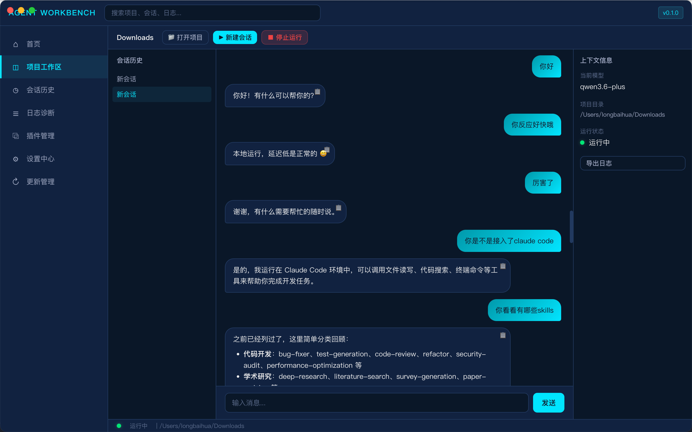
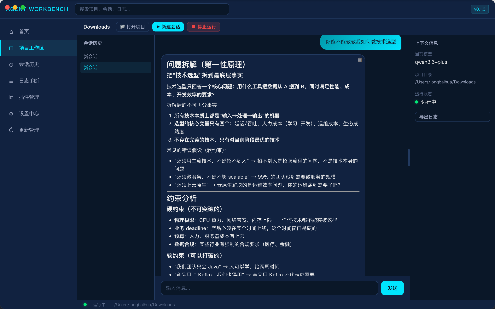
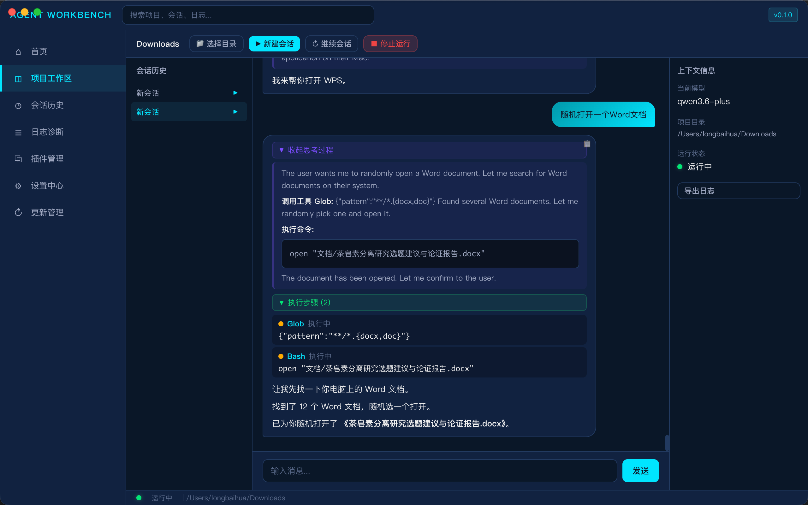
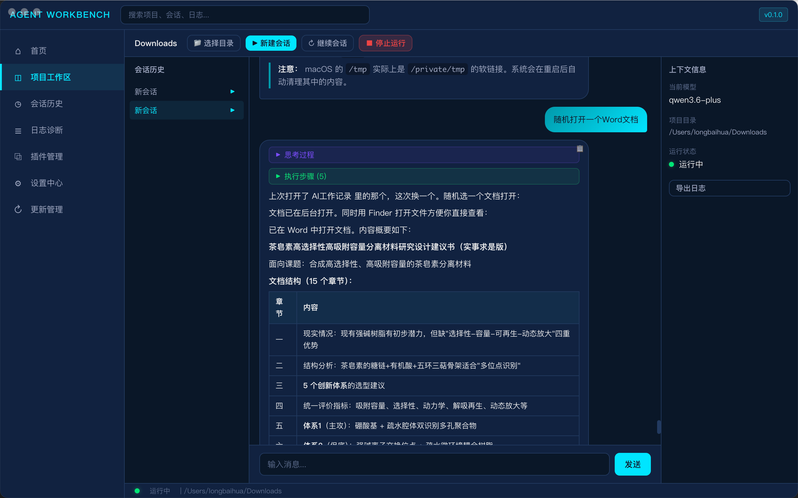

# Agent Workbench

**A Visual Desktop GUI for Claude Code CLI**

可视化 AI 编程助手桌面客户端 —— 基于 Electron 封装 Claude Code CLI 的 GUI。

---

## Project Value / 项目价值

### Why This Project Exists / 为什么需要这个项目

**Problem / 痛点：**

Claude Code 是一个强大的 CLI 编程助手，但终端界面存在天然局限：

- 纯文本终端无法展示结构化对话、代码块高亮不够直观
- 历史记录管理困难，无法按项目/会话分类检索
- 多项目并行时缺乏可视化的会话切换机制
- 配置 API Key、代理、模型参数等需要记忆命令行参数
- 无法快速查看日志、诊断问题

**Solution / 解决方案：**

将 Claude Code CLI 封装为带三栏聊天界面的桌面应用：

- 聊天气泡渲染，支持 Markdown 代码高亮、表格、列表
- 按项目自动归档会话，支持历史回溯与继续对话
- 一键切换会话、项目目录、模型配置
- 内置日志管理、插件管理、版本更新功能
- 支持离线使用、离线补丁导入

### Target Users / 目标用户

| 用户 | 价值 |
|------|------|
| 开发者 | 不用离开 IDE 就能管理多个项目的 AI 对话 |
| 技术经理 | 统一配置模型、API 网关，团队标准化 |
| 初学者 | 可视化界面降低了 CLI 使用门槛 |
| 离线环境用户 | 支持离线补丁，网络受限时仍可使用 |

---

## Architecture / 架构设计

### 整体架构 / Overall Architecture

```
┌──────────────────────────────────────────────────────────────┐
│                     Electron 主进程                          │
│                                                              │
│  main.ts ── 窗口管理 + IPC 路由分发                          │
│     │                                                        │
│     ├── cli-manager.ts  ── spawn('claude') 子进程管理         │
│     ├── config-manager.ts ── 配置读写 + API Key 加密         │
│     ├── session-manager.ts ── SQLite 会话 CRUD                │
│     ├── log-manager.ts ── 日志查询 + 诊断包导出               │
│     ├── plugin-manager.ts ── MCP 插件扫描/启停                │
│     └── updater.ts ── 版本检查 + 离线补丁导入                 │
│                                                              │
│  database.ts ── better-sqlite3 封装                          │
│  config.ts ── 应用目录初始化                                  │
│                                                              │
│         ↕ IPC (invoke/handle + webContents.send)             │
├──────────────────────────────────────────────────────────────┤
│                     Electron 渲染进程                        │
│                                                              │
│  React 18 + TypeScript + Vite                                │
│  @tanstack/react-query (状态管理)                              │
│  React Router (HashRouter)                                   │
│                                                              │
│  7 个页面：首页 / 工作区 / 会话 / 日志 / 插件 / 设置 / 更新    │
│  核心页面 Workspace：三栏布局（会话列表 / 聊天 / 上下文）       │
│                                                              │
│  preload.ts ── contextBridge 安全隔离                        │
└──────────────────────────────────────────────────────────────┘
```

### CLI 通信协议 / CLI Communication Protocol

```
用户输入 → api.cli.input(sessionId, text)
            ↕ IPC
         cli-manager.sendInput()
            ↕ stdin (JSON 行)
      ┌─────────────┐
      │  claude 子进程 │  claude -p --verbose
      │  (ChildProcess) │  --input-format=stream-json
      │               │  --output-format=stream-json
      └──────┬────────┘
             ↕ stdout (JSON 行)
         逐行解析：
           - type: assistant → 累积回复文本
           - type: result    → 发送完整 assistant 气泡
           - type: system    → 系统事件（init、error）
             ↕ webContents.send('cli-output')
             ↕ IPC
         React 渲染聊天气泡 + 持久化到 SQLite
```

### 数据模型 / Data Model

```sql
sessions    ── 会话 (id, project_dir, name, status, cli_pid, summary)
messages    ── 消息 (session_id, role, content, timestamp)
configs     ── 配置 (key, value, encrypted)
logs        ── 日志 (timestamp, component, level, event, summary)
plugins     ── 插件 (id, name, version, enabled, source)
update_history ── 更新记录 (from_version, to_version, status, method)
```

---

## Technology Stack / 技术栈

| Layer | Technology |
|-------|-----------|
| Framework | Electron 33 |
| Renderer | React 18 + TypeScript + Vite 6 |
| Routing | React Router (HashRouter) |
| State | @tanstack/react-query |
| Database | better-sqlite3 |
| Build | electron-builder (macOS DMG, ARM64) |

---

## Getting Started / 快速开始

### Prerequisites / 前置条件

- Node.js >= 18
- npm >= 9
- macOS ARM64（开发/打包环境）

### Installation / 安装

```bash
cd claude-code-gui
npm install
```

### Development / 开发

```bash
# 推荐：同时启动 Vite + Electron
npm run dev

# 或分别启动：
# 终端 1 - Vite 开发服务器
npm run dev:renderer

# 终端 2 - Electron
npm start
```

### Build / 构建

```bash
# 构建 renderer + 编译 Electron 主进程
npm run build
```

### Package / 打包

```bash
# 打包 macOS DMG (ARM64)
npm run package:mac
```

产物输出至 `release/` 目录。

---

## Feature Modules / 功能模块

| Module | Path | Description |
|--------|------|-------------|
| 首页 | `/` | 状态总览、快捷操作、最近访问 |
| 工作区 | `/workspace` | 三栏布局（项目树 / 终端 / 上下文），CLI 生命周期管理 |
| 会话 | `/sessions` | 按项目筛选、搜索、归档、删除 |
| 日志 | `/logs` | 级别筛选、详情面板、导出/诊断包 |
| 插件 | `/plugins` | 插件卡片、版本/来源、启用/禁用 |
| 设置 | `/settings` | 通用/账号/网关/代理/更新配置 |
| 更新 | `/updates` | 版本信息、在线检查、离线补丁导入 |

---

## IPC Channels / IPC 通信通道

| Namespace | Channels | Description |
|-----------|----------|-------------|
| `config` | `get` / `save` / `testConnection` | 配置读写 + 连接测试 |
| `cli` | `start` / `stop` / `input` / `status` / `onOutput` / `onExit` / `onStatus` | CLI 进程控制与事件监听 |
| `session` | `list` / `create` / `delete` / `messages:save` / `messages:load` | 会话 CRUD + 消息持久化 |
| `log` | `list` / `export` / `diagnostic` | 日志查询与导出 |
| `plugin` | `list` / `toggle` | 插件管理 |
| `update` | `check` / `importPatch` / `info` | 更新管理 |
| `fs` | `selectDirectory` / `readFile` | 文件系统操作 |
| `app` | `getVersion` / `getPlatform` | 应用信息 |

---

## Data Storage / 数据存储

| Resource | Path |
|----------|------|
| Database | `~/Library/Application Support/agent-workbench/app.db` |
| Logs | `~/Library/Application Support/agent-workbench/logs/` |
| Plugins | `~/Library/Application Support/agent-workbench/plugins/` |
| Config | `~/Library/Application Support/agent-workbench/config.json` |

---

## Project Structure / 项目结构

```
├── electron/                     # 主进程
│   ├── main.ts                   # 入口、窗口、IPC 注册
│   ├── preload.ts                # Context Bridge 安全隔离
│   ├── config.ts                 # 路径与目录初始化
│   ├── database.ts               # SQLite 封装
│   └── handlers/
│       ├── cli-manager.ts        # Claude Code 子进程管理
│       ├── config-manager.ts     # 配置读写 + API Key 加密
│       ├── session-manager.ts    # 会话 CRUD + 消息持久化
│       ├── log-manager.ts        # 日志查询 + 诊断包
│       ├── plugin-manager.ts     # MCP 插件扫描/启用/禁用
│       └── updater.ts            # 版本检查 + 离线补丁
├── database/
│   └── schema.sql                # 6 张核心表
├── config/
│   └── default.json              # 默认配置
├── renderer/                     # 渲染进程 (React)
│   ├── vite.config.ts
│   ├── src/
│   │   ├── lib/api.ts            # IPC 封装 + Mock
│   │   ├── components/           # ChatBubble, Sidebar, TopBar, Terminal, StatusCard
│   │   └── pages/                # 7 个页面
│   └── dist/                     # 构建产物
├── electron-builder.json         # DMG 打包配置
├── tsconfig.base.json            # 共享 TS 配置
└── package.json                  # 根工作区 (npm workspaces)
```

---

## IMG 运行图片









## License

MIT
